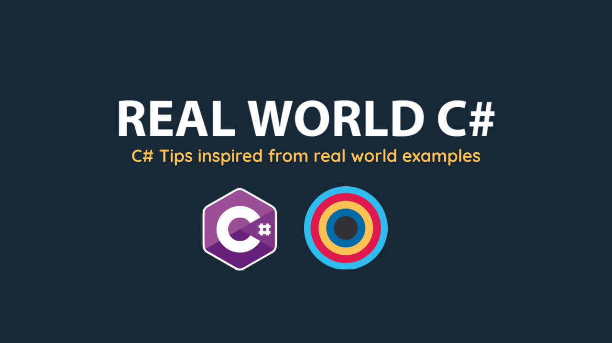

# Real World C#

YouTube Link - https://www.youtube.com/playlist?list=PLi6bCyLotG-Gqp9gx_qdXBaUaPQuKN8kN

In this series, I share some small tips around C# and .NET, inspired from real world examples that I encounter. They are not perfect and not production ready but I hope they nevertheless help you.

## #1 - How to Create a Windows Service?

1. How to create a Windows service in C# .NET? 
2. How to create a background job in C#? 
3. How to create a REST API client in C#? 
4. How to use Topshelf to create a windows service?

### Resouces

1. [Topshelf](https://topshelf.readthedocs.io/en/latest/index.html)
2. [JsonPlaceholder](https://jsonplaceholder.typicode.com/)

YouTube Link - https://www.youtube.com/playlist?list=PLi6bCyLotG-Gqp9gx_qdXBaUaPQuKN8kN
